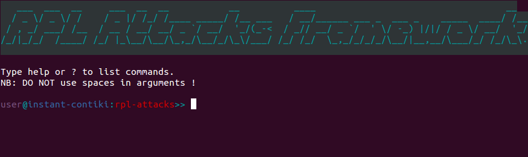
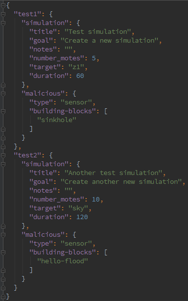

RPL Attacks Framework
=====================

This project is aimed to provide a simple and convenient way to generate simulations and deploy malicious motes for a Wireless Sensor Network (WSN) that uses Routing Protocol for Low-power and lossy devices (RPL) as its network layer.

With this framework, it is possible to easily define campaign of simulations either redefining RPL configuration constants or using an own external RPL library. Moreover, campaign can be generated either based on a same or a randomized topology for each simulation.


System Requirements
-------------------

This framework was tested on an **InstantContiki** appliance (that is, an Ubuntu 14.04).

It was tested with **Python 2 and 3**.


Installation
------------

1. Clone this repository

 ```
 git clone https://github.com/dhondta/rpl-attacks.git
 ```

2. Install system requirements

 ```
 sudo apt-get install gfortran libopenblas-dev liblapack-dev
 sudo apt-get install -qq python-numpy python-scipy
 sudo apt-get install imagemagick gcc-msp430 libcairo2-dev libffi-dev
 ```

3. Install Python requirements

 ```
 sudo pip install -r requirements.txt
 ```

 or

 ```
 sudo pip3 install -r requirements.txt
 ```

4. Setup dependencies and test the framework

 ```
 ../rpl-attacks$ fab test
 ```


Non-Standard Configuration
--------------------------

**This section only applies if you want to tune Contiki's source folder and/or your experiments folder.**

Create a default configuration file

 ```
 ../rpl-attacks$ fab config
 ```

 or create a configuration file with your own parameters (respectively, *contiki_folder* and *experiments_folder*)

 ```
 ../rpl-attacks$ fab config:/opt/contiki,~/simulations
 ```

Parameters :

- `contiki_folder`: the path to your contiki installation

>  [default: ~/contiki]

- `experiments_fodler`: the path to your experiments folder

>  [default: ~/Experiments]

These parameters can be later tuned by editing ``~/.rpl-attacks.conf``. These are written in a section named "RPL Attacks Framework Configuration".

Example configuration file :

```
[RPL Attacks Framework Configuration]
contiki_folder = /opt/contiki
experiments_folder = ~/simulations
```


Quick Start (using the integrated console)
------------------------------------------

1. Open the console (you should see something like in the following screenshot)

 ```
 ../rpl-attacks$ fab console
 ```

 or

 ```
 ../rpl-attacks$ python main.py
 ```

 or

 ```
 ../rpl-attacks$ python3 main.py
 ```

 

2. Create a campaign of simulations

 ```
 user@instant-contiki:rpl-attacks>> prepare sample-attacks
 ```

3. Go to your experiments folder (default: `~/Experiments`) and edit your new `sample-attacks.json` to suit your needs

4. Make the simulations

 ```
 user@instant-contiki:rpl-attacks>> make_all sample-attacks
 ```

5. Run the simulations (multi-processed)

 ```
 user@instant-contiki:rpl-attacks>> run_all sample-attacks
 ```

**Hint** : You can type ``status`` during ``make_all`` and ``run_all`` processing for getting the status of pending tasks.


Quick Start (using `fabric`)
----------------------------

1. Create a simulation campaign file from the template

 ```
 ../rpl-attacks$ fab prepare
 ```

 or create a simulation campaign file with a custom name

 ```
 ../rpl-attacks$ fab prepare:test-campaign
 ```

2. Edit the simulation campaign file to suit your needs

3. Create the simulations

 ```
 ../rpl-attacks$ fab make_all:test-campaign
 ```

4. Run the simulations (not multi-processed)

 ```
 ../rpl-attacks$ fab run_all:test-campaign
 ```


Commands
--------

Commands are used by typing **``fab [command here]``** (e.g. ``fab launch:hello-flood``) or in the framework's console (e.g. ``launch hello-flood``).

- **`build`**`:name`

> This will the malicious mote from the simulation directory named 'name' and upload it to the target hardware.

- **`clean`**`:name`

> This will clean the simulation directory named 'name'.

- **`config`**`[:contiki_folder, experiments_folder`]

> This will create a configuration file with the given parameters at `~/.rpl-attacks.conf`.
>
>  `contiki_folder`: path to Contiki installation [default: ~/contiki]
>
>  `experiments_folder`: path to your experiments [default: Experiments]

- **`cooja`**`:name[, with-malicious-mote]`

> This will open Cooja and load simulation named 'name' in its version with or without the malicious mote.
>
>  `with-malicious-mote`: flag for starting the simulation with/without the malicious mote [default: false]

- **`drop`**`:simulation-campaign-json-file`

> This will remove the campaign file named 'simulation-campaign-json-file'.

- **`list`**`:type-of-item`

> This will list all existing items of the specified type from the experiment folder.
>
>  `type-of-item`: `experiments` or `campaigns`

- **`make`**`:name[, n, mtype, max_range, blocks, ext_lib, duration, title, goal, notes, target]`

> This will create a simulation named 'name' with specified parameters and also build all firmwares from ``root.c``, ``sensor.c`` and ``malicious.c`` templates with the specified target mote type. This can alternatively make the malicious mote with an external library by providing its path.
>
>  `n`: number of sensors (excluding the root and malicious motes) [default: 10]
>
>  `mtype`: malicious mote type (`root` or `sensor`) [default: `sensor`]
>
>  `max_range`: malicious mote's maximum range from the root [default:
>
>  `blocks`: building blocks for building the malicious mote, as defined in `./templates/building-blocks.json` [default: empty]
>
>  `ext_lib`: external RPL library for building the malicious mote [default empty]
>
>  `duration`: simulation duration in seconds [default: 300]
>
>  `title`: simulation title [default: empty]
>
>  `goal`: simulation goal (displayed in the Notes pane) [default: empty]
>
>  `notes`: simulation notes (appended behind the goal in the Notes pane) [default: empty]

- **`make_all`**`:simulation-campaign-json-file`

> This will generate a campaign of simulations from a JSON file. See ``./templates/experiments.json`` for simulation campaign JSON format.

- **`prepare`**`:simulation-campaign-json-file`

> This will generate a campaign JSON file from the template located at `./templates/experiments.json`.

- **`remake_all`**`:simulation-campaign-json-file`

> This will re-generate malicious motes for a campaign of simulations from a JSON file.

- **`run`**`:name`

> This will execute the given simulation, parse log files and generate the results.

- **`run_all`**`:simulation-campaign-json-file`

> This will the simulation campaign. See ``./templates/experiments.json`` for simulation campaign JSON format.

- **`setup`**

> This will setup Contiki, Cooja nad upgrade msp430-gcc for RPL Attacks.

- **`status`**

> This will the status of current multi-processed tasks.

- **`test`**

> This will test the framework.


Simulation campaign
-------------------

Example JSON for a campaign with a BASE simulation as a template for the other simulations (with the same topology) :

 

Example JSON for a campaign of heterogeneous simulations (with randomized topologies) :

 
