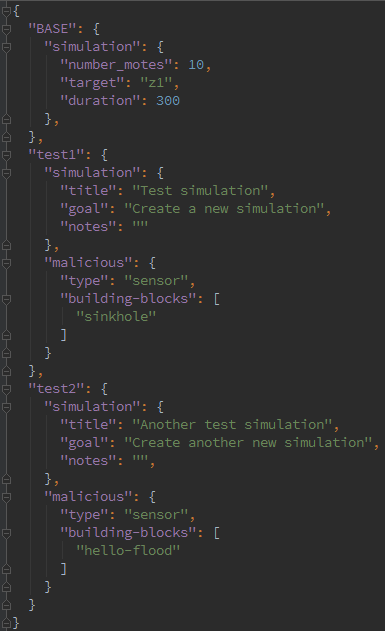

This section explains how to build a campaign of simulations. Hence, it details the possible parameters and how to use them for tuning the simulations.

-----

## Creation Process

**1. Prepare your JSON**

With the interactive console:
 
```shell-session
user@instant-contiki:rpl-attacks>> make_all sample-attacks
```

Or with Fabric:

```shell-session
../rpl-attacks$ fab prepare:test-campaign
```

When generating the campaign JSON, the framework will fill the docstrings at the beginning of the file with some useful information about available items, namely:

- Building-blocks
- Root mote types (the C files prefixed with `root-` in `[FRAMEWORK_FOLDER]/templates/experiment/motes/`)
- Sensor mote types (the C files prefixed with `sensor-` in `[FRAMEWORK_FOLDER]/templates/experiment/motes/`)
- Malicious mote types (the C files prefixed with `malicious-` in `[FRAMEWORK_FOLDER]/templates/experiment/motes/`)


**2. Tune the JSON according to the following structure**

**With a common topology for all simulations**
 
```javascript
{
 "BASE": {
   "simulation": { 
     "[field]": [value],
     ...
   },
   "malicious": {
     "[field]": [value],
     ...
   }
 },
 "[experiment]": {
   "simulation": { 
     "[field]": [value],
     ...
   },
   "malicious": {
     "[field]": [value],
     ...
   }
 },
 [other experiment blocks]
}
```

**BASE**: (mandatory)
 
> **simulation**
>
>  **Field** | **Value**
>  --- | ---
>  `title` | string
>  `goal` | string
>  `notes` | string
>
>> Inside the simulation file (.CSC), the text in the SimulationNotes plugin will be generated with the following layout:
>>
>> `Goal: [goal]`
>> 
>> `[notes]`
>
>  **Field** | **Value**
>  --- | ---
>  `number-motes` | non-null positive integer (this is the number of non-root motes)
>  `target` | string amongst the available platforms in `[CONTIKI_FOLDER]/platform/`
>  `duration` | non-null positive integer, duration in seconds
>  `debug` | boolean, for printing debug messages of the ContikiRPL library
>  `repeat` | non-null positive integer, number of simulation repetitions [NOT IMPLEMENTED YET]
>  `root` | string amongst the suffixes (that is, excluding `root-`) of C files in `[FRAMEWORK_FOLDER]/templates/experiment/motes/`
>  `sensor` | string amongst the suffixes (that is, excluding `sensor-`) of C files in `[FRAMEWORK_FOLDER]/templates/experiment/motes/`
>  `minimum-distance-from-root` | non-null positive integer determining the minimal distance *of the malicious mote* from the root
>  `transmission-range` | positive integer greater than or equal to `minimum-distance-from-root`
>  `interference-range` | positive integer greater than or equal to `transmission-range`
>  `area-square-side` | positive integer greater than or equal to `sqrt(2) * minimum-distance-from-root
>  `wsn-generation-algorithm` | string indicating the WSN topology generation algorithm to be used

> **malicious**: **NOT** present in **BASE**
>   (the experiments start after the **BASE** definition)


**[experiment]**: (mandatory)
 
> **simulation**
>
>> Here, the same parameters as for **simulation** in **BASE** can be entered. They override these of the **BASE** block.

> **malicious**
> 
>  **Field** | **Value**
>  --- | ---
>  `target` | string amongst the available platforms in `[CONTIKI_FOLDER]/platform/`
>  `type` | string amongst the suffixes (that is, excluding `malicious-`) of C files in `[FRAMEWORK_FOLDER]/templates/experiment/motes/`
>  `building-blocks` | list of strings amongst the blocks defined in `[FRAMEWORK_FOLDER]/templates/building-blocks.json`
>  `external-library` | the path to a user-defined RPL library
>
>> This means that the malicious mote can be compiled with a platform different than the rest of the WSN.


**With a specific topology for each simulation**
 
Same as for the structure with **BASE**, except that this block is not present and each experiment holds a **simulation** section with the same available parameters (if this section is not mentioned, default parameters are use

-----

## Examples

Example JSON for a campaign with a BASE simulation as a template for the other simulations (with the same topology) :



Example JSON for a campaign of heterogeneous simulations (with randomized topologies) :


